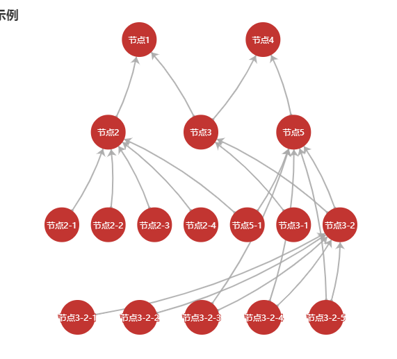

* 将json格式的nTree数据转换成echarts中的关系图

** 示例json

```json
[
  {
    name: "节点1",
    child: [
      {
        name: "节点2",
        child: [
          {
            name: "节点2-1"
          },
          {
            name: "节点2-2"
          },
          {
            name: "节点2-3"
          },
          {
            name: "节点2-4"
          },
          {
            name: "节点5-1"
          }
        ]
      },
      {
        name: "节点3",
        child: [
          {
            name: "节点3-1"
          },
          {
            name: "节点3-2",
            child: [
              {
                name: "节点3-2-1"
              },
              {
                name: "节点3-2-2"
              },
              {
                name: "节点3-2-3"
              },
              {
                name: "节点3-2-4"
              },
              {
                name: "节点3-2-5"
              }
            ]
          }
        ]
      }
    ]
  },
  {
    name: "节点4",
    child: [
      {
        name: "节点3"
      },
      {
        name: "节点5",
        child: [
          {
            name: "节点5-1"
          },
          {
            name: "节点3-2"
          },
          {
            name: "节点3-2-3"
          },
          {
            name: "节点3-2-4"
          },
          {
            name: "节点3-2-5"
          }
        ]
      }
    ]
  }
]
```

** 效果图

